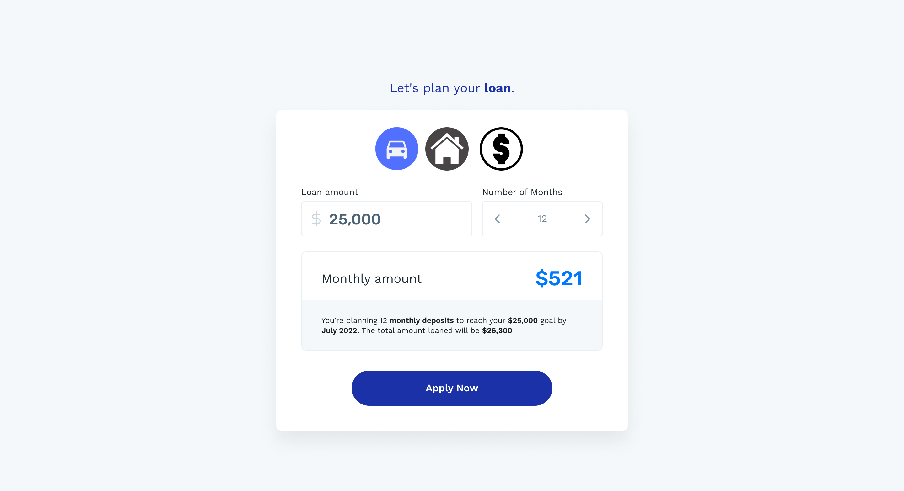

# Welcome BITS Candidates
If you're reading this, you've passed your interview, so Congrats! Now its time to show us that you can code and can fill the backend position available.

&nbsp;
&nbsp;

---
## Preparing The Environment
---
You need to install docker and docker-compose before you begin working:

- https://docs.docker.com/desktop/
- https://docs.docker.com/compose/install/


Once the installation is complete, open up a command line or a terminal and run:

> docker-compose up

The first time you run this command, building the environment can take a few minutes.


That's it. Just Access `http://localhost:5001` in your browser.


&nbsp;
&nbsp;

---
## The Task
---


You will build a screen where the user wants to apply for a loan, but before they do that, they want to know how much interest and the monthly installments will be for their loan

In the screen, you will build a calculator in which, the users choose (i) the loan type they want to apply for, (ii) the amount they want to apply for,  (iii) and the number of months to repay the loan.

When the users changes the value of any of the inputs, the monthly installment value, the interest value and the total loan amount is calculated and displayed to them.


### Assets
You can find the layout mockups here on our Figma project:
[Layout mockups](https://www.figma.com/file/yCUfV4uHFWrWKenma3FH23/Bits-Svelte-Frontend)

Once you have opened the link you must sign up and log in so you can have access to the colors, fonts, margins and assets information.

### Products

The products component should:
- Be fetched from `/products.json`. Each product definition is as follows:
```json
    {
        "id": "product id",
        "interest": "The rate of interest",
        "namr": "Product name",
        "min_amount": "Minimum amount allowed to be loaned",
        "max_amount": "Max amount allowed to be loaned",
        "min_tenure": "Minimum number of months allowed",
        "max_tenure": "Maximum number of months allowed",
        "image": "Image to use as the icon"
    }
```
- Each product should be displayed using the product.image property
- When a product is changed, reset the loan and months to their respective minimums

### Loan Amount input

The money input component should:

- Allow only numbers
- Display the value formatted as money (e.g 3500.45 should be 3,500.44)
- Respect the min and max amounts of the selected product

### Months input

The month input component should:

- Allow only numbers
- When clicking on the arrow buttons it should go up and down by one
- On focused, the users should be able to increase/decrease by typing the Up and Down arrow key on the keyboard respectively
- Respect the min and max tenure properties of the selected product

### Description & Details
- When the Amount or months changes perform the following calculation to get the total amount:

```
total amount = loan amount + (loan amount * product interest)
```

```
monthly installment = total amount / # months
```

```
target month = current month + # months
```

### Confirm button

You don't need to add any action on the confirmation button

&nbsp;
&nbsp;
---
## What will I be assessed on
---
1. If your code works
3. Your application structure
4. How close your page is to the mockups, both on mobile & desktop
5. How clean and organized your code is
6. How long it took you to complete the task


&nbsp;
&nbsp;

---
## Questions
---
You can share any question/concern you have on teams. Not all your questions maybe answered, sometimes you may have to assume and justify your decisions.

&nbsp;
&nbsp;


# Good Luck!